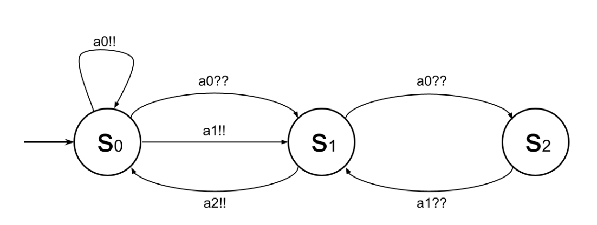

# Random Broadcast Protocols

The project in this repository is used to generate random broadcast protocols
and compute their cutoff. Experimental findings and more details on the theory
behind broadcast protocols can be found in this [paper](TODO).

It also outlines the details of the cutoff finding algorithm and the generation
of random protocols.

## Experiment Data

We include the data generated for the experiments in the [paper](TODO) as
`zip` files in the release artifacts. They include the generated protocols
as `.broadcast` files, as well as the `experiment` files which include the
outcome of the reachability algorithm.

A more detailed description of the file formats can be found in the section
[File Formats](#file-formats).

## Using the Broadcast Protocol Tool

In general, the program distinguishes two modes of operation:

- **Random Generation**: This mode generates a fixed number of random examples
  and checks reachability on those examples. For more details
  [see](#random-generation).

- **File Checking**: This mode assumes the presence of existing broadcast
  protocol files will read all of them from the given directory. For more
  details [see](#file-checking).

The modes are selected by setting the according CLI parameters.

### CLI Parameters

The following options are supported :

```bash
Usage: random-broadcast [options]
Allowed options:
  -h [ --help ]                    produce help message
  --from-files arg                 check processes from existing files
  -p [ --processes ] arg (=-1)     number of process to generate & check
  -s [ --states ] arg (=-1)        number of states for each process
  -a [ --actions ] arg (=-1)       number of actions for each process
  -f [ --filename ] arg            base name for produced broadcast protocol
                                   files
  -d [ --direct-to-last ] arg (=0) optional: allows/disallows direct transition
                                   to last state
  --timeout-min arg (=60)          optional: configure the timeout for a
                                   reachability query in min
  --buffer arg (=10000)            optional: set the buffer size of the
                                   processing queue
  --threads arg (=-1)              optional: number of threads to be used for
                                   reachability checking, otherwise using all
                                   available threads
  --experiment-off                 optional: disables experiment mode
  --debug                          optional: enables debug mode
```

### Random Generation

This program mode can be used to generate a fixed number of protocols (set via
the `-p/--processes`) option, with a fixed number of states (set via the
`-s/--states` option) and actions (set via the `-a/--actions` option).

Additionally, it requires providing a value for the `-f/--filename` flag,
which specifies a prefix that will be present in all produced output files.

The program will then generate the following files:

- Automaton Files: They will be named according to the name supplied via the
  `--filename` flag, appended with the number of the automaton. Their file
  ending is`.broadcast`.

- `experiment_<states>x<actions>_<supplied_filename>.txt`: Stores the
  results of the reachability checks. The creation of this file can be disabled
  by setting the `--experiment-off` flag.

- (Optional) `check_<states>x<actions>_<supplied_filename>.txt`: Stores the logs
  of the program when `--debug` is set.

**Example**:

```bash
./random-broadcast -p 5 -a 2 -s 3 -f rand-at
```

Executing the program with these parameters will create 5 random processes with
2 actions and 3 states and will store them in files with the prefix `rand-at`.

#### Additional Options

By default the program will not allow a sending action to the last state. This
is a sufficient condition to exclude broadcast protocols with cutoff of $1$.
(Mode details can be found in the [paper](TODO)). However, you can allow the
generation of such examples by setting the `-d/--direct-to-last` to `true`.

### File Checking

In this mode the program reads all files ending with `.broadcast` in the
directory specified by the path supplied to the `--from-files` flag.

It will then check reachability on all supplied protocols and produce the
following file(s):

- `experiment_<dir-name>_<supplied_filename>.txt`: Stores the
  results of the reachability checks. The creation of this file can be disabled
  by setting the `--experiment-off` flag.

- (Optional) `check_<dir-name>_<supplied_filename>.txt`: Stores the logs
  of the program when `--debug` is set.

**Example**:

```bash
./random-broadcast --from-files ./<file_dir>/
```

Executing the program with this parameter will result in the program checking
all `.broadcast` files in the directory `./<file_dir>/`.

### Additional Parameters

The following parameters can be set in both modes, all of them are optional:

- `--timeout-min` : Allows to set a timeout in $min$ for each reachability
  computation. The default is $60min$.
- `--buffer`: Allows to set the buffer size, i.e. how many examples are kept
  concurrently in memory for the worker threads. Default is $1000$.
- `--threads`: Configure how many threads should be used for checking examples
  concurrently. By default the program will try to read the amount of threads
  available on your system and attempt to use all of them.
- `--debug`: Enable debug messages and store logs in `check` file.

### Using the included Executable

The executable can be found as part of the release artifacts, named
`random-broadcast`. It is compiled for Linux systems.

#### Prerequisite

In order to use the program locally, the following packages will be necessary:

- the [spdlog library](https://github.com/gabime/spdlog)
- and the [boost libraries](https://www.boost.org/)

`spdlog` is used for logging and `boost` is used to generate
the CLI interface.

On a Debian-based systems that can be done using:

```bash
# Install the libraries
sudo apt-get install libspdlog-dev libboost-all-dev
```

### Using the Docker Image

Instead of building the included binary you can instead use the docker image.
The program can be executed by simply using:

```bash
export IMG=ghcr.io/pleich/cutoffs-for-broadcast-protocols:latest
docker run ${IMG} <cli-args>
```

In this case, `ghcr.io/pleich/cutoffs-for-broadcast-protocols:latest` is the name
of the docker image and `<cli-args>` are the arguments you wish to pass to the
program ([see](#cli-parameters)).

Running the image in this fashion will, however, not store the produced files as
the container storage is ephemeral. If storing the produced output is desired,
this can be achieved by mounting a local directory to the container, for
example, by using:

```bash
docker run \
  --entrypoint /storage.sh \
  -v <dir-to-store-files>:/storage \
  ${IMG} \
  <cli-args>
```

Notice that this command uses a shell script as its entrypoint. This script will
compress all files into a `.zip` archive, which is desirable, mainly when
producing many processes.

The same method can be used to check existing protocol files, however, the
regular entrypoint can be used in that case.

## File Formats

### `.broadcast`

When the program is run in the [`Random Generation` mode](#random-generation)
the application creates a separate `.broadcast` file for each protocol. Each
protocol is given by a protocol matrix $P$ of strings, where $P [i, j]$ shows
what transitions go from state $s_i$ to state $s_j$ . If no transitions go from
$s_i$ to $s_j$ then $P [i, j] = e$. As we are dealing with only broadcast
transitions (in particular, no rendezvous transitions exist), for simplification
purposes the send and receive transitions are given by $a!$ and $a?$,
respectively, instead of $a!!$ and $a??$. For example, consider the
protocol with $3$ states and $3$ actions in the following figure:



The protocol matrix of the protocol above looks like:

$
    \begin{pmatrix}
    a0!a1?a2? & a1!a0? & e \\
    a2! & a1?a2? & a0? \\
    e & a1? & a0?a2?
    \end{pmatrix}
$

### Experiment Results

The produced `experiment_<..>` files will contain entries in a human-readable
format:

All entries are of the form:

```
Protocol <file-name> needs <n> processes. Check time: <t>ms Termination reason: <reason>
```

Where :

- `<file-name>`: is the name of the file where the protocol matrix is stored.
- `<n>`: is the cutoff of the protocol. The number is negative if the final
  state is not reachable.
- `<t>`: is the time it took to execute the reachability check for the protocol.
- `<reason>`: represents the state with which the reachability check terminated.
  This should be `reachable`, `unreachable` or `timeout`. An entry with a
  termination reason `ERR` can occur if the input file format is invalid.

**Example**:

```
Protocol at_0.broadcast needs 2 processes. Check time: 0ms Termination reason: reachable
Protocol at_1.broadcast needs 2 processes. Check time: 0ms Termination reason: reachable
Protocol at_2.broadcast needs 2 processes. Check time: 0ms Termination reason: reachable
Protocol at_3.broadcast needs -1 processes. Check time: 0ms Termination reason: unreachable
Protocol at_4.broadcast needs 2 processes. Check time: 0ms Termination reason: reachable
```

> _Disclaimer_:
> The files produced for the results in the paper contain begin each entry with
> `Automaton` instead of `Protocol`. Additionally, the check time in case of a
> timeout will report as `30`, an artifact of an incautious type conversion that
> has been fixed in this version.
